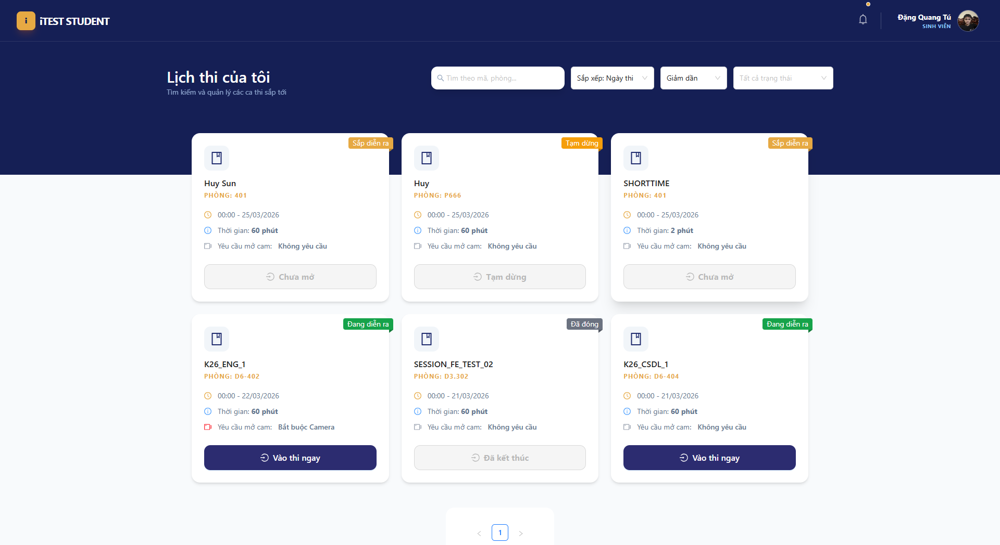
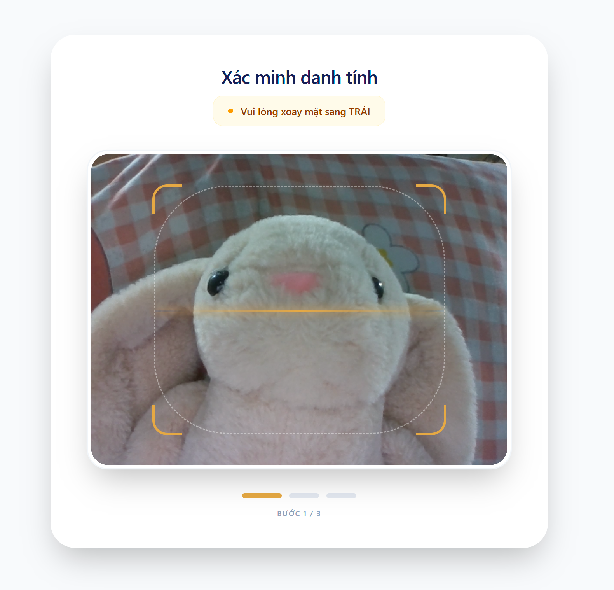
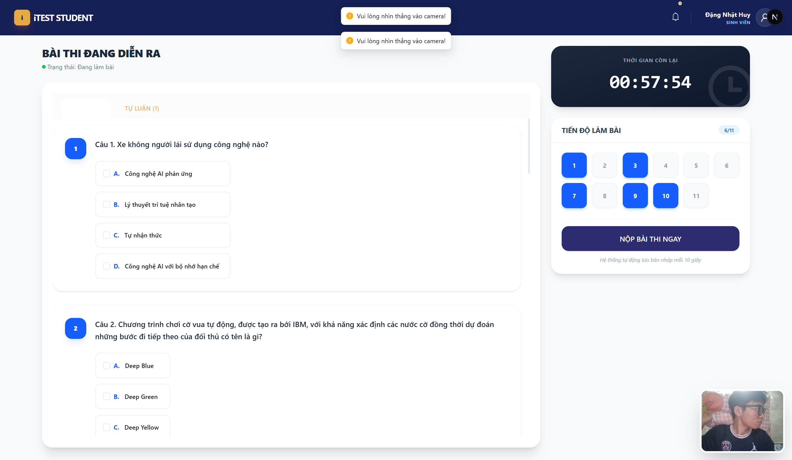
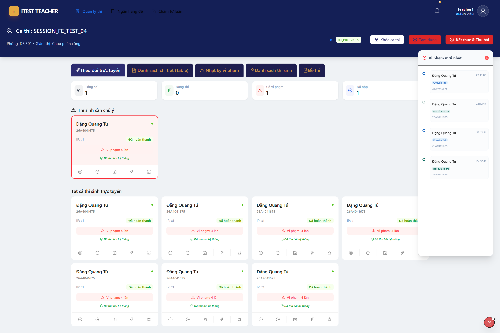

<div align="center">

# 📝 iTEST

### *A Modern Online Examination Platform for Banking Academy*

[](https://nextjs.org/)
[](https://reactjs.org/)
[](https://www.typescriptlang.org/)
[](https://tailwindcss.com/)
[](https://ant.design/)
[](https://tanstack.com/query)

iTEST là nền tảng thi trực tuyến dành cho Học viện Ngân hàng, cung cấp giải pháp tổ chức thi an toàn, chống gian lận với khả năng sinh đề tự động bằng AI. Hệ thống hỗ trợ đầy đủ luồng thi từ tạo đề, quản lý ca thi, giám sát thời gian thực qua camera cho đến chấm điểm và xem kết quả.

</div>

---

## 📋 Mục lục

- [✨ Tính năng](#-tính-năng)
- [🛠️ Công nghệ sử dụng](#️-công-nghệ-sử-dụng)
- [📁 Cấu trúc dự án](#-cấu-trúc-dự-án)
- [🚀 Cài đặt & Chạy dự án](#-cài-đặt--chạy-dự-án)
- [⚙️ Biến môi trường](#️-biến-môi-trường)
- [📄 Các trang chính](#-các-trang-chính)
- [🔐 Xác thực & Phân quyền](#-xác-thực--phân-quyền)

---

## ✨ Tính năng

- 📝 **Quản lý đề thi (Exam Set)** – Tạo, chỉnh sửa, xóa bộ đề; cấu trúc đề theo Part → QuestionGroup → Question
- 🤖 **Sinh đề bằng AI** – Sinh đề thi từ file PDF (giáo trình, tài liệu) qua Gemini API, xử lý song song với chunk overlap
- 🖊️ **Editor đề thi** – Soạn thảo trực quan với hỗ trợ công thức toán học (KaTeX), hình ảnh, file đính kèm ở 3 cấp
- 🖼️ **Quản lý media** – Upload/embed hình ảnh ở cấp Part, QuestionGroup, Question; hiển thị inline
- 📅 **Quản lý ca thi (Exam Session)** – Tạo lịch thi, đăng ký tham gia cho sinh viên
- 🎥 **Giám sát thời gian thực** – Theo dõi thí sinh qua camera với MediaPipe FaceMesh + phát hiện khuôn mặt quay trái/phải
- 🚨 **Phát hiện gian lận** – Nhận diện 7 hành vi gian lận (thiếu người, nhiều người, quay trái/phải, nhìn chệch, sử dụng thiết bị, rời tab)
- ❤️ **Heartbeat & Auto-save** – Gửi tín hiệu sống 5 giây/lần, tự động lưu bài làm, phát hiện mất kết nối sau 15 giây
- ⏸️ **Tạm dừng / Tiếp tục** – Cho phép giám thị can thiệp tạm dừng và tiếp tục bài thi
- 📊 **Chấm điểm tự động & thủ công** – Tự động chấm trắc nghiệm, hỗ trợ chấm điểm bài luận cho giảng viên
- 📈 **Xem kết quả & Thống kê** – Chi tiết bài làm, điểm số, thống kê theo ca thi
- 🔐 **Xác thực & Phân quyền** – JWT với 3 vai trò: Admin, Teacher, Student
- 🛡️ **Bảng quản trị (Admin)** – Quản lý tài khoản, giảng viên, sinh viên, đề thi, ca thi, vai trò, cài đặt hệ thống

---

## 🛠️ Công nghệ sử dụng

| Công nghệ | Phiên bản | Mô tả |
|---|---|---|
| [Next.js](https://nextjs.org/) | 16 | Framework React với App Router |
| [React](https://reactjs.org/) | 19 | UI Library |
| [TypeScript](https://www.typescriptlang.org/) | 5 | Type-safe JavaScript |
| [TailwindCSS](https://tailwindcss.com/) | 4 | Utility-first CSS framework |
| [Ant Design](https://ant.design/) | 6 | Component UI library |
| [TanStack Query](https://tanstack.com/query) | 5 | Server state & caching |
| [Zustand](https://zustand-demo.pmnd.rs/) | 5 | Lightweight state management |
| [Axios](https://axios-http.com/) | 1 | HTTP client |
| [MediaPipe FaceMesh](https://github.com/google-ai-edge/mediapipe) | 0.4 | Facial landmark detection (client) |
| [MediaPipe Face Detection](https://github.com/google-ai-edge/mediapipe) | 0.4 | Face detection (client) |
| [KaTeX](https://katex.org/) | 0.16 | Math formula rendering |
| [React Markdown](https://remarkjs.github.io/react-markdown/) | 10 | Markdown rendering |
| [@microsoft/fetch-event-source](https://www.npmjs.com/package/@microsoft/fetch-event-source) | 2 | SSE client for real-time events |
| [js-cookie](https://github.com/js-cookie/js-cookie) | 3 | Cookie management |
| [jwt-decode](https://github.com/auth0/jwt-decode) | 4 | JWT token decoding |
| [qs](https://github.com/ljharb/qs) | 6 | Query string parser |
| [uuid](https://github.com/uuidjs/uuid) | 13 | Unique ID generation |

---

## 📁 Cấu trúc dự án

```
itest_fe/
├── public/                         # Static assets (favicon, images)
├── src/
│   ├── app/                        # Next.js App Router
│   │   ├── (client)/
│   │   │   └── (home)/             # Trang chủ
│   │   ├── admin/                  # Bảng quản trị
│   │   │   ├── account/            # Quản lý tài khoản
│   │   │   ├── exam/               # Quản lý bộ đề
│   │   │   ├── examRegistration/   # Đăng ký ca thi
│   │   │   ├── examSession/        # Ca thi (Admin)
│   │   │   ├── examSessionHandling/# Xử lý ca thi realtime
│   │   │   ├── examSessionTeacher/ # Ca thi cho giảng viên
│   │   │   ├── examSet/            # Danh sách bộ đề
│   │   │   ├── overview/           # Tổng quan hệ thống
│   │   │   ├── result/             # Kết quả thi
│   │   │   ├── resultGrading/      # Chấm điểm
│   │   │   ├── role/               # Quản lý vai trò
│   │   │   ├── setting/            # Cài đặt hệ thống
│   │   │   ├── student/            # Quản lý sinh viên
│   │   │   └── teacher/            # Quản lý giảng viên
│   │   ├── auth/                   # Xác thực (login, callback, update password)
│   │   ├── student/                # Sinh viên
│   │   │   ├── examSession/        # Phòng thi
│   │   │   ├── profile/            # Hồ sơ cá nhân
│   │   │   └── result/             # Kết quả thi
│   │   ├── teacher/                # Giảng viên
│   │   │   ├── essayGrading/       # Chấm bài luận
│   │   │   ├── examSession/        # Ca thi giảng dạy
│   │   │   ├── examSet/            # Bộ đề giảng dạy
│   │   │   └── profile/            # Hồ sơ cá nhân
│   │   ├── layout.tsx              # Root layout
│   │   ├── not-found.tsx           # Trang 404
│   │   └── globals.css             # Global styles
│   ├── components/                 # React components
│   │   ├── admin/                  # Components cho admin
│   │   ├── client/                 # Components cho client
│   │   ├── common/                 # Components dùng chung
│   │   └── provider/               # Context / Provider components
│   ├── hooks/                      # Custom React hooks
│   ├── libs/                       # Cấu hình thư viện (axios, socket, ...)
│   ├── queries/                    # TanStack Query hooks
│   ├── services/                   # API service functions
│   ├── stores/                     # Zustand stores
│   ├── types/                      # TypeScript type definitions
│   └── middleware.ts               # Next.js middleware (auth guard + RBAC)
├── .env                            # Biến môi trường (local)
├── next.config.ts                  # Cấu hình Next.js
├── package.json
└── tsconfig.json
```

---

## 🚀 Cài đặt & Chạy dự án

### Yêu cầu hệ thống

- **Node.js** >= 18.x
- **npm** >= 9.x hoặc **yarn** >= 1.22.x

### Bước 1: Clone dự án

```bash
git clone <repository-url>
cd itest_fe
```

### Bước 2: Cài đặt dependencies

```bash
npm install
```

### Bước 3: Cấu hình biến môi trường

Tạo file `.env` tại thư mục gốc (copy từ `.env.example` nếu có):

```bash
cp .env.example .env
```

Sau đó cập nhật các giá trị trong file `.env` (xem phần [Biến môi trường](#️-biến-môi-trường)).

### Bước 4: Chạy môi trường phát triển

```bash
npm run dev
```

Ứng dụng sẽ chạy tại: **http://localhost:3001** (hoặc port khác nếu 3001 đã bị chiếm)

### Build cho Production

```bash
npm run build
npm run start
```

### Lint code

```bash
npm run lint
```

---

## ⚙️ Biến môi trường

Tạo file `.env` ở thư mục gốc dự án với nội dung sau:

```env
# URL API của backend
NEXT_PUBLIC_API_URL=http://localhost:3000/api/v1
```

| Biến | Mô tả | Ví dụ |
|---|---|---|
| `NEXT_PUBLIC_API_URL` | Base URL của REST API backend | `http://localhost:3000/api/v1` |

> **Lưu ý:** Các biến có tiền tố `NEXT_PUBLIC_` sẽ được expose ra phía client. Không đặt thông tin nhạy cảm vào các biến này.

---

## 📄 Các trang chính

### Public

| Route | Mô tả |
|---|---|
| `/` | Trang chủ |

### Auth

| Route | Mô tả | Yêu cầu đăng nhập |
|---|---|---|
| `/auth/login` | Đăng nhập | ❌ |
| `/auth/updatePassword` | Cập nhật mật khẩu | ❌ |
| `/auth/callback` | OAuth callback | ❌ |

### Student

| Route | Mô tả | Yêu cầu đăng nhập |
|---|---|---|
| `/student` | Dashboard sinh viên | ✅ (Student) |
| `/student/examSession` | Phòng thi / Danh sách ca thi | ✅ (Student) |
| `/student/result` | Kết quả thi cá nhân | ✅ (Student) |
| `/student/profile` | Hồ sơ cá nhân | ✅ (Student) |

### Teacher

| Route | Mô tả | Yêu cầu đăng nhập |
|---|---|---|
| `/teacher` | Dashboard giảng viên | ✅ (Teacher) |
| `/teacher/examSet` | Quản lý bộ đề | ✅ (Teacher) |
| `/teacher/examSession` | Ca thi giảng dạy | ✅ (Teacher) |
| `/teacher/essayGrading` | Chấm bài luận | ✅ (Teacher) |
| `/teacher/profile` | Hồ sơ cá nhân | ✅ (Teacher) |

### Admin

| Route | Mô tả | Yêu cầu đăng nhập |
|---|---|---|
| `/admin` | Dashboard Admin | ✅ (Admin) |
| `/admin/overview` | Tổng quan hệ thống | ✅ (Admin) |
| `/admin/account` | Quản lý tài khoản | ✅ (Admin) |
| `/admin/student` | Quản lý sinh viên | ✅ (Admin) |
| `/admin/teacher` | Quản lý giảng viên | ✅ (Admin) |
| `/admin/role` | Quản lý vai trò | ✅ (Admin) |
| `/admin/exam` | Tạo đề thi (PDF upload + AI + Editor) | ✅ (Admin) |
| `/admin/examSet` | Danh sách bộ đề | ✅ (Admin) |
| `/admin/examSession` | Quản lý ca thi | ✅ (Admin) |
| `/admin/examSessionHandling` | Xử lý ca thi realtime | ✅ (Admin) |
| `/admin/examSessionTeacher` | Ca thi cho giảng viên | ✅ (Admin) |
| `/admin/examRegistration` | Đăng ký ca thi | ✅ (Admin) |
| `/admin/result` | Kết quả thi | ✅ (Admin) |
| `/admin/resultGrading` | Chấm điểm | ✅ (Admin) |
| `/admin/setting` | Cài đặt hệ thống | ✅ (Admin) |

---

## 🔐 Xác thực & Phân quyền

Dự án sử dụng **JWT (JSON Web Token)** lưu trong cookie (`accessToken`) để xác thực người dùng với cơ chế **RBAC (Role-Based Access Control)**.

### Luồng xác thực (Middleware)

```
Request đến
    │
    ├─ Trang Auth (Login) + Có token hợp lệ → Redirect về role dashboard
    │
    ├─ Trang Public (/) → Cho qua
    │
    ├─ Không có token → Redirect về "/auth/login"
    │
    └─ Có token nhưng role không phù hợp → Redirect về role dashboard tương ứng
```

### Phân quyền

- **Student** – Dashboard sinh viên, tham gia phòng thi, xem kết quả, hồ sơ cá nhân
- **Teacher** – Dashboard giảng viên, quản lý bộ đề, ca thi, chấm bài luận, hồ sơ
- **Admin** – Toàn quyền + truy cập tất cả trang `/admin`

---

## 🤖 Sinh đề bằng AI

iTEST tích hợp **Google Gemini API** để tự động sinh đề thi từ tài liệu học tập (PDF). Quy trình xử lý:

1. **Upload PDF** – Giảng viên upload file giáo trình / tài liệu
2. **Chunk & Overlap** – PDF được chia nhỏ thành các chunk với 1 trang overlap để tránh mất dữ liệu biên
3. **Parallel Processing** – Gọi Gemini API song song với `p-limit` (tối đa 3 luồng đồng thời)
4. **Merge & Dedup** – Kết quả được gộp lại, loại bỏ câu hỏi trùng lặp
5. **Normalize** – Chuẩn hóa dữ liệu về format ExamData → Part → QuestionGroup → Question
6. **Editor** – Giảng viên có thể chỉnh sửa trực tiếp sau khi sinh đề

---

## 📝 Exam Editor
### Đặt vấn đề
Trong thực tế, một đề thi không chỉ đơn thuần bao gồm các câu hỏi trắc nghiệm với bốn đáp án cố định mà còn có thể được chia thành nhiều phần, mỗi phần sở hữu nội dung, hình ảnh hoặc tài nguyên riêng. Mỗi câu hỏi có thể đính kèm nhiều hình ảnh, tệp âm thanh, hỗ trợ nhiều đáp án đúng hoặc được nhóm lại để sử dụng chung một ngữ cảnh. Bên cạnh đó, các đề thi được tạo bởi AI không phải lúc nào cũng đảm bảo dữ liệu hoàn toàn chính xác. 

Để giải quyết vấn đề này, hệ thống xây dựng một cơ chế render đề thi linh hoạt có khả năng xử lý nhiều cấu trúc dữ liệu khác nhau, đồng thời hạn chế tối đa các lỗi giao diện khi gặp dữ liệu thiếu hoặc không hợp lệ.

Bên cạnh đó, hệ thống cung cấp một Exam Editor cho phép giáo viên chỉnh sửa trực tiếp mọi thành phần của đề thi trước khi xuất bản.

### Tính năng nổi bật
- Hỗ trợ đề thi nhiều phần (Section).
- Mỗi phần có thể có nội dung mô tả, hình ảnh hoặc tài nguyên riêng.
- Hỗ trợ nhiều loại câu hỏi khác nhau.
- Câu hỏi có thể chứa nhiều hình ảnh hoặc tệp âm thanh.
- Hỗ trợ câu hỏi nhiều đáp án đúng.
- Hỗ trợ nhóm câu hỏi dùng chung một ngữ cảnh hoặc đoạn văn.
- Tự động xử lý các trường hợp dữ liệu thiếu hoặc không đúng định dạng.
- Tránh lỗi crash giao diện khi gặp đề thi không hợp lệ.
- Cho phép giáo viên chỉnh sửa mọi thành phần của đề thi thông qua Exam Editor.

### Cấu trúc đề thi

```typescript
interface ExamData {
  hasParts: boolean;
  parts: Part[];
}

interface Part {
  partIndex: number;
  partTitle: string;
  partDescription: string | null;
  questionType?: string;
  mediaPlaceholders: MediaPlaceholder[];
  questionGroups: QuestionGroup[];
  questions: Question[];
}

interface QuestionGroup {
  groupInstruction: string;      // Hướng dẫn / passage cho nhóm câu
  questionIndices: number[];     // Danh sách index câu hỏi thuộc nhóm
  mediaPlaceholders: MediaPlaceholder[] | null;
}

interface Question {
  questionIndex: number;
  questionText: string;
  questionType: string;          // SINGLE_CHOICE | MULTIPLE_CHOICE | TRUE_FALSE | FILL_IN_THE_BLANK | ESSAY
  options: Option[] | null;
  mediaPlaceholders: MediaPlaceholder[] | null;
}

interface Option {
  label: string;    // A, B, C, D...
  text: string;
}

interface MediaPlaceholder {
  mediaType: 'image' | 'audio';
  description: string;
  url: string;
  publicId: string;
}
```


### Các thành phần
#### 📦 Quản lý Part (Phần thi)
- Thêm, sửa, xóa các phần thi.
- Chỉnh sửa tiêu đề và mô tả của từng phần.
- Đính kèm hình ảnh hoặc âm thanh dùng chung cho toàn bộ phần thi.
- Tự động đánh lại thứ tự Part khi có thay đổi.

#### 🗂️ Quản lý Question Group
- Tạo nhóm câu hỏi có chung ngữ cảnh.
- Chỉnh sửa nội dung hướng dẫn hoặc đoạn văn dùng chung.
- Gán câu hỏi vào nhóm bằng số thứ tự.
- Hỗ trợ hình ảnh và âm thanh cho từng nhóm.
- Tự động kiểm tra và loại bỏ chỉ số câu hỏi trùng lặp.

#### ❓ Quản lý Question
Hỗ trợ nhiều loại câu hỏi:

- Single Choice
- Multiple Choice
- True / False
- Fill In The Blank
- Essay

Các chức năng:
- Thêm, sửa, xóa câu hỏi.
- Thay đổi loại câu hỏi.
- Chỉnh sửa nội dung câu hỏi và các lựa chọn.
- Đính kèm hình ảnh hoặc âm thanh.
- Tự động đánh lại số thứ tự câu hỏi.

#### ✅ Quản lý đáp án
Khai báo đáp án đúng cho từng loại câu hỏi.
Hỗ trợ nhiều đáp án đúng đối với Multiple Choice.
Nhập điểm số cho từng câu hỏi.
Kiểm tra dữ liệu trước khi lưu.

#### 🖼️ Quản lý Media
Media có thể được gắn ở nhiều cấp độ:
- Part Media
- Question Group Media
- Question Media
Hệ thống hỗ trợ upload và quản lý hình ảnh, âm thanh thông qua Cloudinary.

### Quy trình tạo đề thi hoàn chỉnh

```
Bước 1: Nhập thông tin cơ bản
├── Tiêu đề đề thi (vd: "Đề thi THPT Quốc Gia 2024")
├── Bộ đề (chọn từ danh sách ExamSet)
├── Mã đề (tags input, nhiều mã: M01, M02, M03...)
└── Có tự luận? (checkbox)

Bước 2: Upload file PDF
├── Chọn file .pdf
├── Upload lên Supabase Storage
├── Nhận signedUrl
└── Xóa file cũ nếu có

Bước 3: Phân tích bằng AI
├── Gửi signedUrl + prompt đến Gemini
├── Gemini trả về JSON cấu trúc đề thi
├── Hậu xử lý (merge, dedup, normalize)
├── Chuẩn hóa dữ liệu cho Editor
└── Hiển thị Editor với dữ liệu đã phân tích

Bước 4: Chỉnh sửa trên Editor
├── Sửa Part (thêm/xóa/sửa tiêu đề, mô tả, media)
├── Sửa QuestionGroup (thêm/xóa/sửa instruction, media)
├── Sửa Question (thêm/xóa/sửa nội dung, loại, options, media)
├── Nhập đáp án và điểm cho từng câu
└── Validation: kiểm tra đầy đủ đáp án, điểm > 0

Bước 5: Lưu đề thi
├── Validate dữ liệu (validateBeforeSave)
├── Build payload (buildPayload)
├── POST /exams → Backend
├── Transaction: Exam → Parts → QuestionGroups → Questions → QuestionAnswers
└── Thông báo thành công, giữ nguyên dữ liệu để tiếp tục chỉnh sửa
```

---

## 🎥 Quá trình thi
Giai đoạn làm bài thi là quá trình thí sinh tham gia ca thi, xác thực danh tính qua khuôn mặt, nhận đề thi, thực hiện trả lời các câu hỏi dưới sự giám sát thời gian thực và nộp bài. Hệ thống hỗ trợ nhiều loại câu hỏi (trắc nghiệm một/nhiều đáp án, đúng/sai, điền khuyết, tự luận), tự động lưu nháp định kỳ, đồng hồ đếm ngược, giám sát camera qua MediaPipe FaceMesh với 7 hành vi phát hiện gian lận, cơ chế heartbeat 5 giây và xử lý gián đoạn (tạm dừng, mất kết nối, nộp ép). Kết quả bài thi được tổng hợp và chấm điểm tự động hoặc chuyển giảng viên chấm bài tự luận.

### Đối tượng tham gia
- **Thí sinh (Student):** người thực hiện bài thi
- **Giám thị (Teacher/Proctor):** người giám sát ca thi, có quyền tạm dừng, thu bài, cảnh cáo

### Đặc tả chi tiết quá trình làm bài thi

#### 1. Vào ca thi

**Mô tả:** Cho phép thí sinh tham gia một ca thi đang diễn ra. Hệ thống kiểm tra điều kiện tham gia, thực hiện xác thực khuôn mặt (nếu được yêu cầu), sinh đề thi ngẫu nhiên và tạo lượt làm bài cho thí sinh. (ExamAttempt).

**Chức năng chính:**
- Kiểm tra trạng thái ca thi và quyền tham gia của thí sinh.
- Thực hiện xác thực khuôn mặt khi ca thi yêu cầu giám sát bằng camera.
- Sinh ngẫu nhiên một mã đề từ bộ đề đã được cấu hình.
- Tạo hoặc khôi phục lượt làm bài (Exam Attempt).
- Tự động khôi phục câu trả lời nháp từ Redis khi thí sinh bị mất kết nối.
- Gửi thông báo tham gia ca thi theo thời gian thực đến giám thị thông qua SSE.
- Trả về thông tin đề thi, thời gian làm bài và trạng thái giám sát cho giao diện thí sinh.

<div align="center">

</div>
---


#### 2. Xác thực khuôn mặt

**Mô tả:** Hệ thống hỗ trợ hai cơ chế xác thực khuôn mặt: (a) xác thực khi vào ca thi và (b) xác thực định kỳ trong quá trình làm bài.

##### 2.1. Xác thực khi vào thi

- So sánh ảnh chụp từ webcam với dữ liệu khuôn mặt đã đăng ký.
- Thực hiện thông qua dịch vụ nhận diện khuôn mặt riêng biệt (FastAPI).
- Kết quả xác thực được lưu vào hồ sơ đăng ký dự thi.

<div align="center">

</div>

##### 2.2. Xác thực định kỳ trong lúc thi

- Tự động chụp ảnh từ webcam theo chu kỳ trong quá trình làm bài.
- Ảnh được gửi về backend và xử lý bất đồng bộ thông qua hàng đợi (BullMQ).
- Các trường hợp xác thực thất bại sẽ được ghi nhận như một hành vi vi phạm quy chế thi.
---

#### 3. Hiển thị đề thi

**Mô tả:** Đề thi được cấu trúc phân cấp gồm **Phần (Part)** → **Nhóm câu hỏi (QuestionGroup)** → **Câu hỏi (Question)**. Frontend hiển thị dưới dạng các tab theo phần, mỗi tab chứa danh sách câu hỏi đã được sắp xếp.

**Chức năng chính:**

#### 📄 Hiển thị đề thi

* Nhận dữ liệu đề thi từ API hoặc Zustand Store.
* Tự động gom và sắp xếp câu hỏi theo `questionNumber`.
* Hiển thị nội dung hướng dẫn và tài nguyên dùng chung của nhóm câu hỏi tại câu hỏi đầu tiên.
* Tách riêng các câu hỏi tự luận vào tab **Tự luận**.
* Hỗ trợ nhiều loại câu hỏi:
  * **Single Choice** (chọn một đáp án)
  * **Multiple Choice** (chọn nhiều đáp án)
  * **True / False**
  * **Fill In The Blank**
  * **Essay**
* Hỗ trợ hiển thị hình ảnh và âm thanh đính kèm.
* Cho phép nộp bài tự luận kèm tệp đính kèm thông qua Cloudinary hoặc Supabase.
* Tối ưu giao diện cho các đề thi có cấu trúc phức tạp hoặc được sinh bởi AI.

<div align="center">

</div>
---

#### 4. Làm bài thi (Answering)

**Mô tả:** Thí sinh tương tác với từng câu hỏi, hệ thống ghi nhận câu trả lời và đồng bộ hóa giữa localStorage, Redis draft và database.

**Xử lý đáp án dựa trên loại câu hỏi:**

| Loại | Input | Định dạng answer |
|---|---|---|
| SINGLE_CHOICE | Radio (A/B/C/D) | Chuỗi "A" |
| MULTIPLE_CHOICE | Checkbox | Mảng ["A","C"] |
| TRUE_FALSE | Radio (True/False) | Chuỗi "TRUE" |
| FILL_IN_THE_BLANK | Input text | Chuỗi nội dung |
| ESSAY | Textarea + file | `{ content, file_metadata: [...] }` |

**Lưu trữ local (localStorage):**
- Mục đích: phòng trường hợp reload trang (F5) không bị mất đáp án

**Đồng bộ dữ liệu:**

- Khi load trang, so sánh giữa localStorage và `cachedSubmission` từ API
- Ưu tiên dùng nguồn có nhiều đáp án hơn
- Tự động đồng bộ khi dữ liệu từ API về sau (effect)

---

#### 5. Tự động lưu nháp (Auto-save Draft)

**Mô tả:** Định kỳ lưu câu trả lời của thí sinh lên Redis thông qua backend để phòng trường hợp mất kết nối hoặc sự cố trình duyệt.

**Cơ chế hoạt động:**

1. Frontend kiểm tra mỗi **10 giây**
2. So sánh dữ liệu hiện tại với lần lưu gần nhất
3. Nếu có thay đổi, gọi bản nháp đến server với payload:
   ```json
   {
     "examSessionId": "...",
     "changes": [{ "questionId": "...", "answer": "..." }]
   }
   ```
4. Khi thí sinh vào thi lại (sau khi mất kết nối), draft answers được đọc từ Redis và trả về dưới dạng `cachedSubmission`
---

#### 6. Đồng hồ đếm ngược

**Mô tả:** Hiển thị thời gian còn lại cho thí sinh, tự động nộp bài khi hết giờ.

**Cơ chế hoạt động:**

1. Tính thời gian kết thúc dựa trên:
   - `duration` (phút): tổng thời gian của ca thi
   - `consumedTime` (giây): thời gian đã tiêu thụ
   - `lastResumedAt`: mốc thời gian tiếp tục gần nhất
2. Công thức: `endTime = lastResumedAt + (duration * 60 - consumedTime) * 1000`
3. Lưu `endTime` vào localStorage để chống F5
4. Nếu giá trị mới chênh lệch > 5 giây so với giá trị đã lưu, cập nhật lại
5. Khi đồng hồ đếm ngược về 0 thì tự động nộp

**Xử lý bất đồng bộ:** Nếu server trả về `consumedTime` mới (do giám thị tạm dừng thi), đồng hồ tự động điều chỉnh.
---

#### 7. Giám sát thời gian thực — Camera (Exam Monitor)

**Mô tả:** Sử dụng MediaPipe FaceMesh để phát hiện khuôn mặt của thí sinh trong thời gian thực, phát hiện các hành vi bất thường.


**Phát hiện vi phạm:**

| Loại vi phạm | Điều kiện | Ngưỡng thời gian |
|---|---|---|
| `NO_FACE_DETECTED` | Không phát hiện khuôn mặt hoặc mặt quá lệch | 1 giây |
| `MULTIPLE_FACES_DETECTED` | Phát hiện ≥ 2 khuôn mặt | 1 giây |
| `NO_FACE_DETECTED` (nghiêng) | Yaw > 0.07 hoặc Pitch > 0.06 | 1 giây |
---

#### 8. Phát hiện và báo cáo gian lận (Fraud Detection)

**Mô tả:** Hệ thống phát hiện các hành vi gian lận từ trình duyệt và camera, ghi nhận vào cơ sở dữ liệu và thông báo cho giám thị qua SSE.

**Các loại gian lận:**

| Loại vi phạm              | Hành vi                                                        |
| ------------------------- | -------------------------------------------------------------- |
| `TAB_SWITCHING`           | Chuyển sang tab hoặc ứng dụng khác trong quá trình làm bài     |
| `WINDOW_BLUR`             | Rời khỏi cửa sổ trình duyệt đang làm bài                       |
| `NETWORK_DISRUPTION`      | Mất kết nối mạng hoặc ngắt kết nối với hệ thống thi            |
| `IP_CHANGED`              | Thay đổi địa chỉ IP trong quá trình làm bài                    |
| `NO_FACE_DETECTED`        | Không phát hiện khuôn mặt thí sinh trước camera                |
| `MULTIPLE_FACES_DETECTED` | Phát hiện nhiều hơn một khuôn mặt trong khung hình             |
| `FACE_MISMATCH`           | Khuôn mặt hiện tại không khớp với dữ liệu khuôn mặt đã đăng ký |


**Giám thị nhận được thông báo qua SSE và có thể thực hiện các hành động:**

   | ProctoringHandleType | Hành vi |
   |---|---|
   | `WARNING` | Cảnh cáo (hiển thị popup trên màn hình thí sinh) |
   | `REPRIMAND` | Khiển trách |
   | `SUSPENSION` | Đình chỉ thi (tự động nộp bài) |
   | `STOP_FOR_SESSION_TRANSFER` | Dừng để chuyển ca |

<div align="center">

</div>
---

#### 9. Heartbeat và phát hiện mất kết nối

**Mô tả:** Duy trì kết nối giữa client và server thông qua cơ chế heartbeat, phát hiện thí sinh mất kết nối.

**Cơ chế hoạt động:**
- Duy trì kết nối giữa thí sinh và hệ thống thông qua cơ chế heartbeat định kỳ.
- Tự động ghi nhận trạng thái hiện diện của thí sinh trên Redis.
- Phát hiện thay đổi địa chỉ IP trong quá trình thi và ghi nhận là hành vi vi phạm.
- Tự động phát hiện các trường hợp mất kết nối mạng hoặc đóng trình duyệt.
- Chuyển trạng thái bài thi sang DISCONNECTED khi thí sinh mất kết nối.
- Gửi thông báo thời gian thực đến giám thị thông qua SSE khi xảy ra sự cố kết nối.
- Tự động khôi phục trạng thái làm bài khi thí sinh kết nối lại.
- Cập nhật thời gian tiếp tục làm bài để đảm bảo tính chính xác của đồng hồ thi.
---

#### 10. Xử lý gián đoạn (Pause/Resume/Disconnect)

**Tạm dừng toàn bộ ca thi**
- Giám thị có thể tạm dừng toàn bộ ca thi đang diễn ra.
- Tự động lưu thời gian đã làm bài của tất cả thí sinh.
- Chuyển trạng thái các lượt thi sang PAUSE.
- Gửi thông báo thời gian thực đến toàn bộ thí sinh thông qua SSE.
- Hiển thị màn hình khóa với thông báo bài thi đang tạm dừng.
**Tiếp tục toàn bộ ca thi**
- Khôi phục trạng thái làm bài của tất cả thí sinh.
- Cập nhật lại mốc thời gian tiếp tục làm bài.
- Đồng bộ trạng thái mới đến các thiết bị đang kết nối thông qua SSE.
**Tạm dừng/Tiếp tục từng thí sinh**
- Cho phép giám thị tạm dừng hoặc tiếp tục bài thi của từng thí sinh riêng lẻ.
- Tự động lưu thời gian đã sử dụng trước khi tạm dừng.
- Khôi phục thời gian làm bài khi tiếp tục thi.
Đảm bảo đồng hồ thi luôn chính xác sau khi khôi phục.

---

#### 11. Nộp bài thi

**Mô tả:** Thí sinh nộp bài thi, hệ thống tự động chấm điểm các câu trắc nghiệm và lưu kết quả.

**Các tình huống nộp bài**

| Tình huống | Kích hoạt | Xác nhận |
|---|---|---|
| Tự nộp | Người dùng nhấn "NỘP BÀI THI" | Modal xác nhận |
| Hết giờ | Timer `onFinish` | Tự động, không cần xác nhận |
| Giám thị thu bài | SSE `TEACHER_COLLECTED` | Tự động |
| Đình chỉ | SSE `SUSPENSION` | Tự động sau 2 giây |
| Giám thị kết thúc ca thi | SSE `SESSION_STATUS_CHANGED` (FINISHED) | Tự động |
---


#### 12. Thi lại (Retake Permission)

**Mô tả:** Giám thị cho phép thí sinh thi lại với đề thi khác trong cùng ca thi.

Hệ thống cho phép giám thị cấp quyền thi lại cho thí sinh trong cùng một ca thi khi cần thiết.

- Kiểm tra điều kiện tham gia và trạng thái ca thi.
- Tự động chọn một đề thi khác trong cùng bộ đề.
- Xóa kết quả và câu trả lời của lần thi trước.
- Khởi tạo lại lượt thi với đề thi mới.
- Đặt lại các thông tin giám sát như cảnh báo và mức độ vi phạm.
- Xóa dữ liệu nháp đã lưu trước đó.
- Gửi thông báo thời gian thực đến thí sinh thông qua SSE.

Khi nhận quyền thi lại, giao diện sẽ:

- Xóa dữ liệu đề thi và câu trả lời cũ.
- Làm mới trạng thái bài thi.
- Tải lại đề thi mới được cấp.
- Cập nhật thông tin lượt thi và tiếp tục làm bài.
---


### Luồng xử lý chính

```
[Sinh viên]                          [Hệ thống]                           [Giám thị]
     |                                   |                                    |
     |-- 1. Xem danh sách ca thi ------>|                                    |
     |<-- 2. Danh sách ca thi ----------|                                    |
     |                                   |                                    |
     |-- 3. Chọn ca thi --------------->|                                    |
     |                                   |-- 4. Kiểm tra trạng thái --------->|
     |                                   |-- 5. Kiểm tra đăng ký ------------>|
     |                                   |                                    |
     |-- 6. Xác thực khuôn mặt --------->|                                    |
     |<-- 7a. Kết quả xác thực ----------|                                    |
     |                                   |                                    |
     |-- 8. Vào thi (Join) ------------->|                                    |
     |                                   |-- 9. Random đề ------------------->|
     |                                   |-- 10. Tạo ExamAttempt ------------>|
     |<-- 11. Dữ liệu đề thi ------------|                                    |
     |                                   |                                    |
     |  ==== QUÁ TRÌNH LÀM BÀI ====     |                                    |
     |                                   |                                    |
     |---[Auto-save]-------------------->|                                    |
     |---[Heartbeat]-------------------->|                                    |
     |---[Phát hiện gian lận]----------->|                                    |
     |                                   |<-- [SSE: trạng thái, cảnh báo] ----|
     |<-- [SSE: sự kiện] ----------------|                                    |
     |                                   |                                    |
     |-- 12. Nộp bài ------------------->|                                    |
     |                                   |-- 13. Tính điểm ------------------>|
     |                                   |-- 14. Lưu kết quả ---------------->|
     |<-- 15. Kết quả bài thi -----------|                                    |
```

---

## Danh sách sự kiện realtime sse
Giao tiếp thời gian thực giữa máy chủ và các thành phần trong hệ thống được thực hiện thông qua cơ chế Server-Sent Events (SSE). Các sự kiện được phân luồng theo hai kênh riêng biệt: kênh giám thị (teacher channel) nhận toàn bộ sự kiện của ca thi và kênh thí sinh (student channel) chỉ nhận các sự kiện dành riêng cho từng thí sinh.

| Loại sự kiện | Kênh | Mô tả |
|---|---|---|
| `STUDENT_JOINED` | Teacher | Thí sinh mới tham gia ca thi |
| `STUDENT_SUBMITTED` | Teacher | Thí sinh nộp bài |
| `STUDENT_VIOLATION` | Teacher | Phát hiện hành vi gian lận của thí sinh |
| `SESSION_STATUS_CHANGED` | Teacher | Trạng thái ca thi thay đổi (mở/đóng/kết thúc) |
| `TIME_WARNING` | Teacher | Cảnh báo thời gian thi sắp hết |
| `ATTEMPT_PAUSED` | Teacher | Ca thi bị tạm dừng |
| `ATTEMPT_RESUMED` | Teacher | Ca thi được tiếp tục |
| `ATTEMPT_DISCONNECTED` | Teacher | Thí sinh mất kết nối |
| `TEACHER_COLLECTED` | Teacher | Giám thị thu bài thí sinh |
| `WARNING` | Student | Giám thị gửi cảnh cáo đến thí sinh |
| `REPRIMAND` | Student | Giám thị khiển trách thí sinh |
| `SUSPENSION` | Student | Giám thị đình chỉ thí sinh |
| `STOP_FOR_SESSION_TRANSFER` | Student | Giám thị yêu cầu dừng bài để chuyển ca |
| `RETAKE_GRANTED` | Student | Thí sinh được phép thi lại |
---

<div align="center">

Made by **Nhat Huy**

</div>
